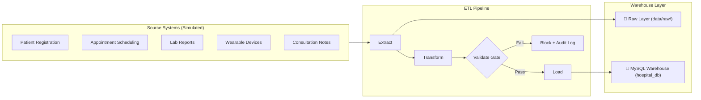

# 🏥 Hospital Patient Care Analytics Pipeline

[](https://www.python.org/downloads/)
[](https://www.mysql.com/)
[](LICENSE)

> **Industry-style, lightweight data engineering pipeline** that collects, processes, validates, and loads hospital patient data from 5 source systems into a MySQL Star Schema Data Warehouse — improving patient care, reducing waiting times, and predicting high-risk patients.

> ⚠️ **Disclaimer**: This project uses **fully synthetic data** for educational purposes. It is **not suitable for real patient data** without proper HIPAA/PHI compliance infrastructure.

---

## 🏗️ Architecture



---

## 📁 Directory Structure

```text
hospital_etl_pipeline/
├── data/
│   └── raw/                        # Generated raw synthetic CSV & JSON data
├── src/
│   └── hospital_pipeline/
│       ├── config.py               # Database connections & environment settings
│       ├── extract.py              # Reads CSV/JSON data from 5 source systems
│       ├── transform.py            # Cleans, standardizes & PHI anonymizes data
│       ├── validate.py             # Data Quality Gate rules engine
│       ├── risk_engine.py          # Clinical risk scoring algorithm
│       ├── load.py                 # Upserts star schema into MySQL
│       ├── logger.py               # Logging helper
│       └── pipeline.py             # Main ETL pipeline orchestrator
├── scripts/
│   └── generate_synthetic_data.py  # Data generator with realistic defects
├── tests/                          # Automated unit tests for ETL logic
│   ├── test_transform.py
│   ├── test_validate.py
│   └── test_risk.py
├── .env.example                    # Environment template
├── .gitignore                      # Ignores secrets, raw data, logs
├── README.md                       # Project documentation
└── requirements.txt                # Core ETL dependencies
```

---

## 🚀 Quick Start (3 Simple Commands)

### 1. Database Setup & Dependencies
```bash
# Create MySQL Database
mysql -u root -p -e "CREATE DATABASE IF NOT EXISTS hospital_db;"

# Copy environment template & edit password
cp .env.example .env

# Install lightweight dependencies
pip install -r requirements.txt
```

### 2. Generate Raw Source Data
```bash
python3 -m scripts.generate_synthetic_data
```

### 3. Run the End-to-End ETL Pipeline
```bash
python3 -m src.hospital_pipeline.pipeline
```

### 4. Run Unit Tests (20/20 Passed)
```bash
python3 -m pytest tests/ -v
```

---

## 📊 Star Schema Design

The pipeline loads data into a 7-table Star Schema warehouse:

1. **`dim_patient`**: Patient demographics (PHI anonymized with `name_hash` and `phone_hash`).
2. **`dim_doctor`**: Doctor details and assigned department.
3. **`dim_department`**: Hospital departments (Cardiology, Neurology, ER, etc.).
4. **`fact_appointments`**: Appointment scheduling, check-in, wait times, and no-show flags.
5. **`fact_lab_results`**: Clinical lab tests and abnormality indicators.
6. **`fact_wearable_readings`**: Hourly heart rate, SpO2, and step count vitals.
7. **`fact_patient_risk`**: High-risk patient predictions and clinical risk reasons.

Plus 2 audit tables:
- **`pipeline_runs`**: Execution status, timestamps, and duration logs.
- **`data_quality_results`**: Data Quality Gate validation results.
