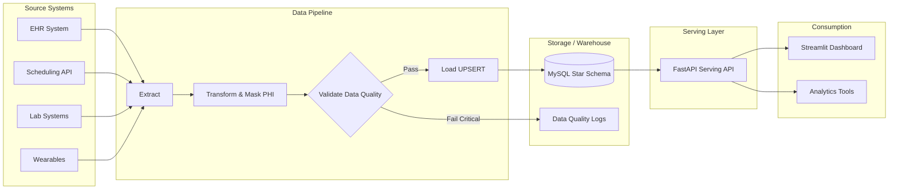
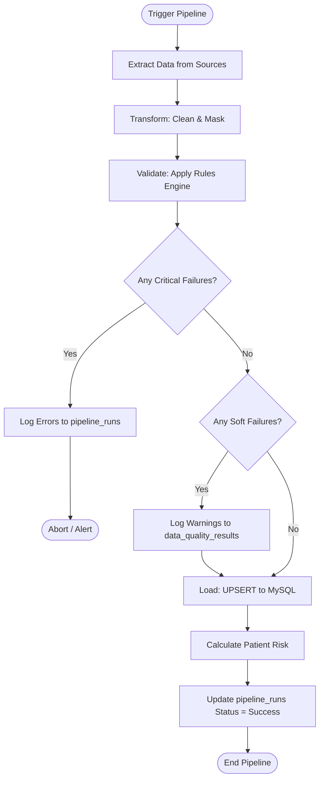

# Architecture

## End-to-End Architecture

## Pipeline Flow (With Quality Gates and Failure Paths)

## Medallion Storage Layers Explanation

While this project utilizes a relational database (MySQL) rather than a Data Lakehouse, it logically follows the principles of the Medallion Architecture to ensure data quality and lineage:

1. **Bronze (Raw)**: Raw JSON payloads are extracted from the source APIs and saved locally in the `data/raw/` directory. This acts as our immutable source of truth and allows reprocessing if the pipeline fails.
2. **Silver (Staging/Cleaned)**: The `pandas` dataframes in memory represent the Silver layer. Here, data types are cast, nulls are handled, schemas are aligned, and Protected Health Information (PHI) is hashed. If written to disk, this goes to `data/staging/`.
3. **Gold (Curated/Warehouse)**: The final, validated data is loaded into the MySQL Star Schema (`hospital_db`). This data is business-ready, highly structured, and optimized for analytical queries (aggregations, joins) by the Serving API.

## Tech Stack Rationale

| Technology | Role | Rationale |
| :--- | :--- | :--- |
| **Python 3.10+** | Core Language | Industry standard for data engineering, robust ecosystem. |
| **Pandas** | Transformation | Lightweight, perfect for in-memory processing of small-to-medium datasets. |
| **MySQL** | Data Warehouse | Ubiquitous relational database, excellent for modeling Star Schemas, easy for students to install/host. |
| **SQLAlchemy** | ORM / DB Access | Provides a safe, database-agnostic way to interact with MySQL, preventing SQL injection. |
| **FastAPI** | Serving & Source APIs | High performance, automatic Swagger UI documentation, easy async support. |
| **Streamlit** | Dashboarding | Rapid prototyping of interactive data apps entirely in Python; no Javascript required. |
| **Pytest** | Testing | Standard for Python unit and integration testing. |

## Data Flow Narrative

1. **Extraction**: The `pipeline.py` script triggers `extract.py`, which makes HTTP GET requests to the Source API (`/source/*`). The JSON responses are saved to `data/raw/` and loaded into pandas DataFrames.
2. **Transformation**: `transform.py` cleans the data. It standardizes dates, normalizes text, and secures PHI by generating SHA-256 hashes of patient names and phone numbers.
3. **Validation**: `validate.py` runs a rules engine against the transformed DataFrames. It checks constraints like "heart rate must be > 0". Results are logged to `data_quality_results`. Critical failures halt the pipeline; soft failures are logged but allow the pipeline to proceed.
4. **Loading**: `load.py` uses SQLAlchemy to insert or update (UPSERT) records in the MySQL database. This ensures the pipeline is idempotent—running it twice won't duplicate data.
5. **Business Logic**: `risk.py` runs against the loaded data to calculate and insert a risk score into `fact_patient_risk`.
6. **Serving & Visualization**: `main.py` serves this curated data via REST endpoints. The Streamlit app queries these endpoints to visualize KPIs, patient 360 views, and high-risk alerts.
