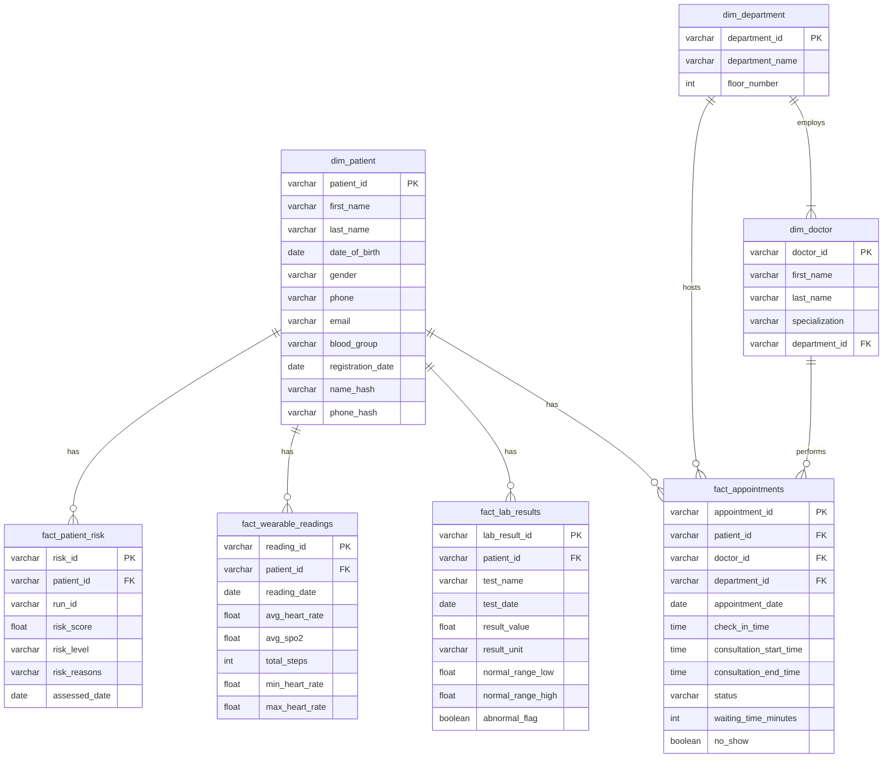

# Data Model

## Star Schema

## Table Descriptions

### Dimension Tables (Who, What, Where)
Dimensions provide the context or descriptive attributes for the business processes.

*   **`dim_patient`**: Stores patient demographic information. 
    *   *Constraints*: `patient_id` (PK, format: P-XXXXX). 
    *   *Security*: `name_hash` and `phone_hash` contain SHA-256 hashes of PII for secure analytics.
*   **`dim_doctor`**: Stores physician details.
    *   *Constraints*: `doctor_id` (PK, format: D-XXXX), `department_id` (FK -> `dim_department`).
*   **`dim_department`**: Stores hospital department locations.
    *   *Constraints*: `department_id` (PK, format: DEPT-XX).

### Fact Tables (Events, Measurements)
Facts contain measurable, quantitative data about business events.

*   **`fact_appointments`**: Records outpatient visits.
    *   *Metrics*: `waiting_time_minutes`, `no_show`.
*   **`fact_lab_results`**: Records clinical laboratory tests.
    *   *Metrics*: `result_value`, `abnormal_flag`.
*   **`fact_wearable_readings`**: Records daily aggregated metrics from patient wearables.
    *   *Metrics*: `avg_heart_rate`, `avg_spo2`, `total_steps`.
*   **`fact_patient_risk`**: A derived fact table storing the computed risk score for patients based on ETL pipeline runs.

### Operational Tables (System Metadata)
*   **`pipeline_runs`**: Tracks ETL execution history (run_id, start_time, rows_loaded, status).
*   **`data_quality_results`**: Stores the output of the validation rules engine for observability.

## Dimension vs. Fact Tables Explained

In dimensional modeling (Kimball methodology):
*   **Dimension tables** are the "nouns" of the business (Patients, Doctors, Departments). They are typically wide, contain text attributes, and are updated less frequently (Slowly Changing Dimensions). They are used to filter, group, and label data.
*   **Fact tables** are the "verbs" or events of the business (Appointments, Lab Results). They are typically narrow, contain foreign keys to dimensions and numeric measurements, and grow rapidly as transactions occur. They are used for calculations and aggregations (SUM, AVG, COUNT).
